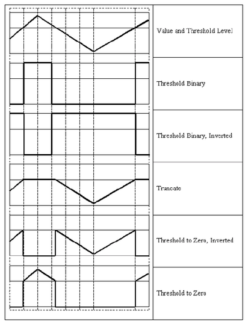
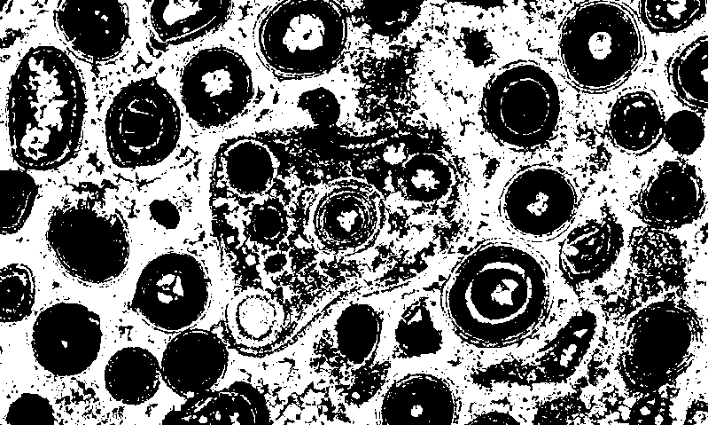
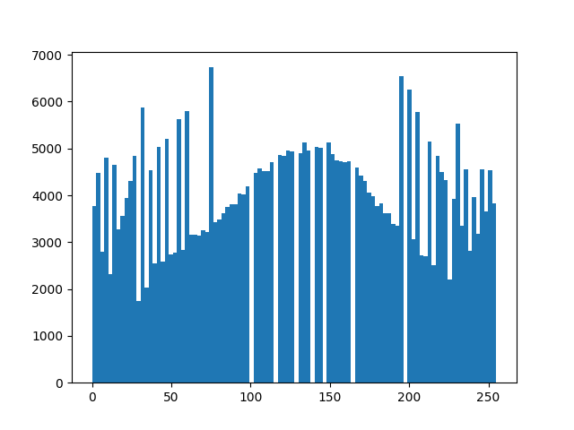
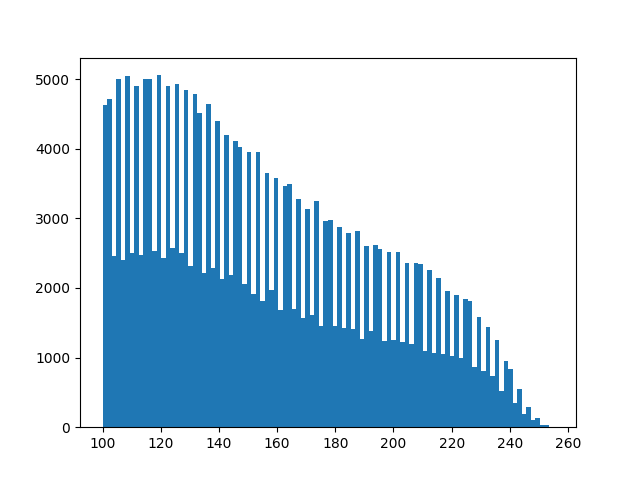

## Description
convert rgb image to thresh hold binary

## src img

## Thresholding para

## Threshold demo

## OSTU demo

## OSTU + binary demo

## CLAHE demo
- Histogram
# befor equalization

# After equalization

# CLAHE image Histogram
